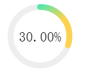
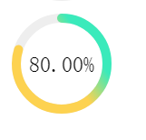

#circleProcess
圆形进度条  

#例子
初始化
<pre>
  $('div').circleProcess({
     value: .5,
     lineCap: 'round',
     thickness: 14,
     fontStyle: {
       size: '24px',
       color: '#fff',
       fontFamily: 'SimSun'
     },
     emptyFill: '#eee',
     bgFill: 'green',
     animationTime: 1000,
     animationType: 'ease-in'
   })
</pre>

改变进度
<pre>
$('div').circleProcess('change', .8)
</pre>
